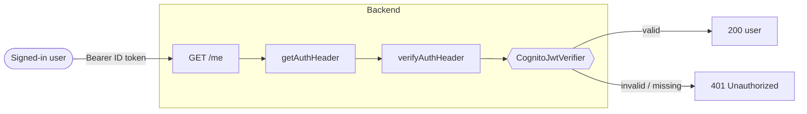
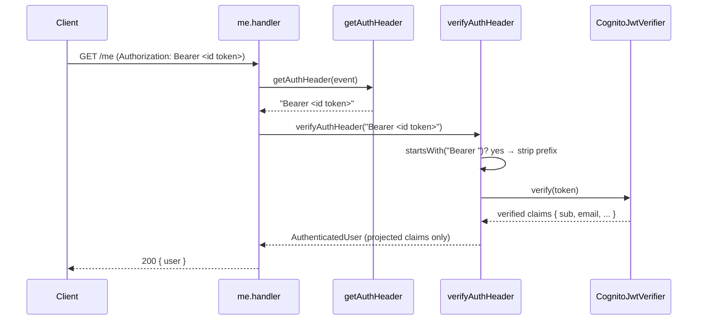
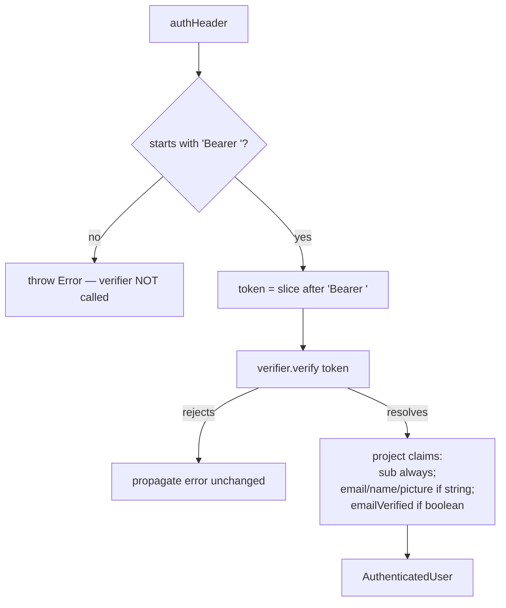
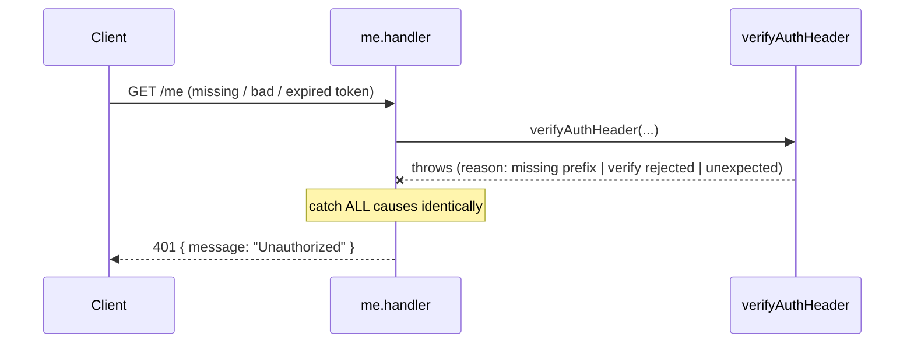

# Diagrams — Auth Module

## Use case

```mermaid
flowchart LR
    U([Signed-in user]) -->|Bearer ID token| ME[GET /me]
    subgraph Backend
      ME --> GAH[getAuthHeader]
      GAH --> VAH[verifyAuthHeader]
      VAH --> V{{CognitoJwtVerifier}}
    end
    V -->|valid| OK[200 user]
    V -->|invalid / missing| NO[401 Unauthorized]
```

## Sequence — successful /me

```mermaid
sequenceDiagram
    participant C as Client
    participant ME as me.handler
    participant AH as getAuthHeader
    participant VH as verifyAuthHeader
    participant V as CognitoJwtVerifier

    C->>ME: GET /me (Authorization: Bearer <id token>)
    ME->>AH: getAuthHeader(event)
    AH-->>ME: "Bearer <id token>"
    ME->>VH: verifyAuthHeader("Bearer <id token>")
    VH->>VH: startsWith("Bearer ")? yes → strip prefix
    VH->>V: verify(token)
    V-->>VH: verified claims { sub, email, ... }
    VH-->>ME: AuthenticatedUser (projected claims only)
    ME-->>C: 200 { user }
```

## Decision — verifyAuthHeader gating

```mermaid
flowchart TD
    A[authHeader] --> B{starts with 'Bearer '?}
    B -- no --> E[throw Error — verifier NOT called]
    B -- yes --> C[token = slice after 'Bearer ']
    C --> D[verifier.verify token]
    D -- rejects --> F[propagate error unchanged]
    D -- resolves --> G[project claims:\nsub always;\nemail/name/picture if string;\nemailVerified if boolean]
    G --> H[AuthenticatedUser]
```

## Sequence — failed /me (any cause)

```mermaid
sequenceDiagram
    participant C as Client
    participant ME as me.handler
    participant VH as verifyAuthHeader

    C->>ME: GET /me (missing / bad / expired token)
    ME->>VH: verifyAuthHeader(...)
    VH--xME: throws (reason: missing prefix | verify rejected | unexpected)
    Note over ME: catch ALL causes identically
    ME-->>C: 401 { message: "Unauthorized" }
```
